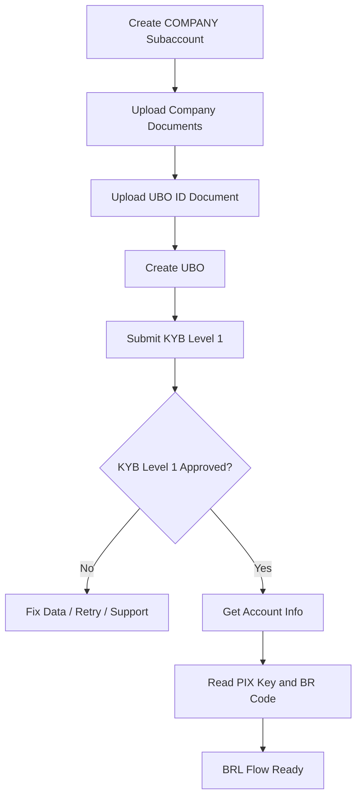

# Avenia BRL Onboarding Summary

## Client Decision

Client confirmed: **Only BRL for now**.

So we can proceed with the BRL/local account flow first. USD Rails / KYB USD can be handled later after Avenia support resolves the PoFC/USD issue.

## Current BRL Status

### KYB-Approved Subaccount

This is the subaccount we should use for the BRL-ready POC:

```text
SubAccount ID: e08c1f3d-fc31-4c04-8bf0-fab528f57cb1
Name: Nexora Digital Solutions Ltd - POC 20260429103441
Company: NEXORA SOLUCOES DIGITAIS LTDA
Tax ID: 11.222.333/0001-81
Identity Status: CONFIRMED
```

BRL / PIX details returned successfully:

```text
PIX Key:
7bf464cf-4e18-40f7-b33e-d2b1ef14ab73

BR Code:
00020126740014br.gov.bcb.pix01367bf464cf-4e18-40f7-b33e-d2b1ef14ab730212BRLA Deposit5204000053039865802BR5917Brla Digital Ltda6009Sao Paulo621005060001si6304139E
```

API tested:

```http
GET /v2/account/account-info?subAccountId=e08c1f3d-fc31-4c04-8bf0-fab528f57cb1
```

Result:

```text
200 OK
identityStatus = CONFIRMED
PIX details returned
```

## New Subaccount Test

A new COMPANY subaccount was also created successfully:

```text
SubAccount ID: a9b6bfa0-25a8-4a81-b70b-59760720d960
Name: Nexora Digital Solutions Ltd - BRL 20260430055109
Identity Status: NOT-IDENTIFIED
```

PIX details were returned:

```text
PIX Key:
7bf464cf-4e18-40f7-b33e-d2b1ef14ab73

BR Code:
00020126740014br.gov.bcb.pix01367bf464cf-4e18-40f7-b33e-d2b1ef14ab730212BRLA Deposit5204000053039865802BR5917Brla Digital Ltda6009Sao Paulo621005060001sw6304D86C
```

Note: this new subaccount is created, but it is **not KYB approved yet**. For BRL-ready testing, use the confirmed subaccount above.

## BRL Onboarding Flow



## API Flow

```text
1. POST /v2/account/sub-accounts
   Creates COMPANY subaccount.

2. POST /v2/documents?subAccountId={subAccountId}
   Creates upload sessions for company and UBO documents.

3. PUT uploadURLFront
   Uploads document files.

4. GET /v2/documents/{documentId}?subAccountId={subAccountId}
   Confirms documents are ready.

5. POST /v2/account/ubos?subAccountId={subAccountId}
   Creates UBO.

6. POST /v2/kyc/new-level-1/api?subAccountId={subAccountId}
   Submits KYB Level 1.

7. GET /v2/account/account-info?subAccountId={subAccountId}
   Gets BRL / PIX account details after KYB confirmation.
```

## Decision Summary

```text
BRL: Ready to continue with confirmed KYB Level 1 subaccount.
USD Rails: Deferred.
Current blocker only affects PoFC / KYB USD, not the BRL-first scope.
```

